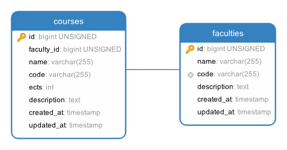

# Assignment 3: Pet Shelter

In the previous assignment, you built a web application using an MVC design pattern. Now, you will implement authentication and authorization features in another MVC application: a pet shelter board. In this application, registered users can adopt pets.

You must follow the instructions **to the letter**, your application will be tested automatically by the same system as the previous assignment. This time, we will provide you with a base application where all the main components you learned in the prior assignment are already implemented. Your job is to implement the components in charge of the authentication and authorization features.

**Disclaimer:** Unless otherwise instructed, do not in any way, modify the contents of the `/tests` directory or the `.gitlab-ci.yml` file. Doing so will be considered cheating, and in the best case, we will fail your assignment.

## Setup

1. Clone your project locally.
2. Run `composer install` to install php dependencies.
3. Create a copy of the .env.example file named .env. This can be done with the command `cp .env.example .env`
4. Run `php artisan key:generate` to generate a random encryption key for your application
5. Run `php artisan serve` to boot up your application

### The project

In this assignment, we provided an already coded application, where you have to fill up the gaps in the source code. This means it is unnecessary for you to create any file, although you can create files if you think they are needed for your application to pass the tests. The files you need to modify to pass this assignment are listed in their corresponding section.

### The database
The project requires a connection to a database. Luckily, thanks to docker, this is extremely simple and platform agnostic. To spin up a MySQL server, run the `docker-compose up -d` within the directory. This will pull a MySQL server, port-forward it to port 3306 on your machine, and start it in detached mode.

Additionally, we have included an installation of _phpmyadmin_ that you can use to explore the database (this will start as part of the docker command), go to [http://localhost:8036](http://localhost:8036), and you should see something like this:

(if the database is empty, you haven't migrated it yet)

You are, of course, still free to use whichever tool you prefer.

The connection to the database is defined as follows:
- host: `localhost`
- port: `3306`
- username: `root`
- password: `secret`
- database: `adoption`

If you followed the steps mentioned earlier and copied your `.env.example` to `.env`, then Laravel should already be configured with the correct connection details.

_Hint: your JetBrains Student subscription comes bundled with __DataGrip__, which can be used to explore your database._

### Relevant commands

- `php artisan migrate` - This will synchronize your database structure to your migrations (read more [here](https://laravel.com/docs/migrations#introduction)), these can be viewed under `database/migrations`. Laravel comes bundled with some by default, which you can either ignore or delete.
- `php artisan migrate:fresh` - Deletes everything within your database and starts the migration from scratch, very useful during development.
- `php artisan migrate:fresh --seed` - Deletes everything within your database, starts the migration from scratch, and seeds the database with some dummy data and cute animals.
- `php artisan make:controller {name of Controller}` - This creates a controller with a specified name. Controllers in Laravel use a singular noun with the `Controller` suffix (HomeController, UserControler... e.g.)
- `php artisan make:model {name of model}` - Creates a model with a specified name (usually singular (User, House, Apartment, Animal...))
- `php artisan make:model {name of model} -mr` - Allows us to create a model with a given name, as well as a controller for it and a migration.
- `php artisan serve` - Starts the development server for the application.

### Testing your solution

Every time you push your code to our source control (gitlab.sdu.dk) (which you will have to do to pass), your code will be validated to see if it meets the requirements of this assignment. This can be slow, especially if other people are also doing it simultaneously (then you will most likely be put in a queue). To mitigate this, you must run your tests locally.

#### Running browser tests

You must run our browser tests using Laravel Dusk. The first time you run the tests on your machine, you will have to install the latest `Chrome` binaries; this can be done with the `php artisan dusk:chrome-driver` command (make sure you have the latest version of chrome).

In another terminal, run `php artisan serve` - this is needed as dusk actively uses the server to test your implementation. Make sure the server is up and running every time you test your implementation.

In your main terminal, run: `php artisan dusk` and `php artisan test` - this will start running your tests.

## Logic

### Base application

As we mentioned, you are given a base pet shelter application. This application should be modified to integrate authentication and authorization features. In the application, users can:
1. See a list of every pet given for adoption
2. Adopt pets

As you can see, these are all the features you learned from the previous assignment.

The application has two models: User and Adoption. User is used to knowing which person is adopting a pet. The Adoption model contains the information necessary to give a pet for adoption: its name and description. Moreover, it contains the foreign key adopted_by, which is used to link the current adoption to the user adopting the pet. You can see the ER diagram of the database here:

We also provided two controllers: Home and Adoption. The Home controller is in charge of the Home page (of course) and the authentication logic (sign in, sign up, etc). The Adoption controller is in charge of all the Adoption logic (index, show adoptions, adopt a pet, etc). You must modify these controllers as instructed.

### Route overview

The following routes are created for the pet shelter application:

| URL                          | Method | Controller         | Description                                                  |
|------------------------------|--------|--------------------|--------------------------------------------------------------|
| /                            | GET    | HomeController     | Shows home page                                              |
| /adoptions                   | POST   | AdoptionController | Creates a new listing for an adoption                        |
| /adoptions/mine              | GET    | AdoptionController | Lists the pets that you have adopted                         |
| /adoptions/{adoption}        | GET    | AdoptionController | Shows the details for a given {adoption}                     |
| /adoptions/{adoption}/adopt  | POST   | AdoptionController | Allows you to adopt a given {adoption}                       |
| /login                       | GET    | HomeController     | Shows the login page                                         |
| /login                       | POST   | HomeController     | Processes the login request and logs the user in             |
| /logout                      | GET    | HomeController     | Logs out the current authenticated user                      |
| /register                    | GET    | HomeController     | Displays the form that creates a new user                    |
| /register                    | POST   | HomeController     | Creates a new user                                           |

## Tasks / Tests

In the new pet shelter application, you have 2 different types of users: guests (not logged in) and users (logged in). For each type, your web application will behave differently.

For guests, your web application should allow them to: (1) see a list of all the pets given for adoption in the system, (2) see the details of an adopted pet, (3) sign up in the system, and (4) login into the system. All other functionalities should be blocked.

Authenticated users are allowed to: (1) check if they are logged in to the system, (2) logout from the system, (3) see a list of all the pets given for adoption, (4) adopt a pet, and (5) see all their adopted pets.

To extend the base application, we provide several files that you should modify. For each task, we give the use case that will be tested and the files you should modify/extend to complete the task.

### 1. [Guest] List of pets for adoption

While users not logged into the system cannot adopt pets, they still can see all the possible pets for adoption. If they find a pet they like, they will have to register for your application!

#### Use case
1. They access the home of your app via the route `/`
2. In the route, they see the following information:
    * A welcome message: `{Name's} Pet Shelter`. You can name the system however you want!
    * A list of all pets given for adoption. This list has the following properties:
        * Every pet should be inside an HTML tag with a class `card`.
        * For each pet, the name and description should be displayed.
            * The pet name should be enclosed in a `.pet-name` class.
            * The pet description should be enclosed in a `pet-description` class.

**This code is already provided for you - just re-use the current cards (/adoptions/partials/card.blade.php), and you are good**

#### Files to modify

In this task, you should modify the `adoptions/list.blade.php` to include the card partial.

#### Tests

`php artisan dusk --filter getListOfAdoptions` - Tests that the listing page shows the correct information and hasn't been broken.

### 2. [Guest] See the details of a pet given for adoption

Guest users can see the details of a pet up for adoption.

#### Use case

1. Go to the home page `/`.
2. Click on a link/button to access the information about a pet for adoption. Each link that goes to the details page of the adoption should have the class `pet-show`.
3. This new page should show the pet's information, name, and description.

**Considerations**
* In a later task, you will implement a button for authenticated users to adopt pets (see 4: [User] Adopt pets). Guest users cannot adopt pets, and this button should not be available for them in this view.

#### Files to modify
The code is already provided, and you should not modify any file. However, when working with later tasks, you may need to modify this file, particularly when adding the adoption button, which should be absent for guest users!

#### Tests

`php artisan dusk --filter guestsCannotAdoptPets` tests that a guest is able to view an adoption but unable to view the adopt button

### 3. [Guest] Registration

Any user can register for your pet shelter application.

#### Use case

1. They access the home of your app via the route `/`
2. They click a link/button that takes them to the registration form. This link should have the class `register-link`.
3. Input the following information: Name, email, password, and confirm password.
5. Click on a button to submit the information to your application.
6. The system register and automatically login the user. _Hint:_ remember to store passwords as hashes using the `bcrypt(password)` helper method.
7. The system redirects the authenticated user to the home route `/`.

#### Files to modify

`resource/views/partials/master.blade.php`

In the HTML tag with class `register-link`, you should add the link that routes to the action `HomeController::register`. We already provide the route in the `routes/web.php` file. Be sure to use the `route(..)` method!

`app/Http/Controllers/HomeController.php`
The view that displays the form for the registration is already created and can be seen in the `HomeController::register` method, however, it's not able to persist the inserted data.
For this task, you should implement the action `doRegister` method, which is in charge of validating fields, creating the user, logging in the user, and redirecting them to the right page.

#### Tests

`php artisan dusk --filter guestRegisterUser` tests that a guest can register to the system.

### 4: [Guest] Login

Users can log in to your system to use the pet adoption board. For this task, the users should not be logged into (i.e. a guest) the system, and they must take the following steps:

#### Use case

1. They access the home of your app via the route `/`
2. They click a link/button that takes them to the login form. This link should have the class `login-link`.
3. Input the following information: email and password.
4. Click on a button to submit the information to your application.
5. The system authenticates the user and redirects them to the home route `/`.

#### Files to modify

`resource/views/partials/master.blade.php`

In the HTML tag with class `login-link`, you should add the link that routes to the action `HomeController::login`. We already provide the route in the `routes/web.php` file. Use `route(..)`!

`app/Http/Controllers/HomeController.php`

The view that displays the form for the log in is already created and can be seen in the `HomeController::register` method, however, it's not able to persist the inserted data.
For this task, you should implement the action `doLogin`, which is in charge of validating the fields, logging in the user, and redirecting them to the right page.

#### Tests

`php artisan dusk --filter guestLoginUser` - attempts to log a user into the system using the login form.

### 1: [User] Check if logged in

When an authenticated user visits your application's home, `/`, their name should appear. This shows the user that they are already logged into the system.

#### Use case

1. When accessing the home of your app, the name of the authenticated user should appear as `$name` within an HTML tag with the class `user-name`

#### Files to modify

`resource/views/partials/master.blade.php`
In the HTML tag with class `user-name` the authenticated user name should be displayed as instructed.

#### Tests

`php artisan dusk --filter userIsLoggedIn` - Generates a user, logs them into the system, and tests if their name is correctly shown in the header.

### 2: [User] Logout
Logged-in users should be able to log out of your system.

#### Use case

1. Go to the home page `/`.
2. Click the link/button to log out with the class `logout-link`.
3. The system logs out the user and redirects them to the home page.

#### Files to modify

`resource/views/partials/master.blade.php`
In the HTML tag with class `logout-link`, you should add the link that routes to the action `HomeController::logout`. We already provide the route in the `routes/web.php` file.

`app/Http/Controllers/HomeController.php`
For this task, you should implement the action `logout`, which is in charge of logging out the user and redirecting them to the right page.

#### Tests

`php artisan dusk --filter testLogoutCurrentUser` create a user and logs them in, then proceeds to log them out.
- **If you see the error `The user is unexpectedly authenticated.`, it means that the user failed to log out of your system.**

### 3. [User] List of pets for adoption

Logged-in users can also see all the possible pets for adoption.

#### Use case

1. They access the home of your app via the route `/`
2. In the route, they see the following information:
    * A welcome message: `{Name's} Pet Shelter`. You can name the system however you want!
    * A list of all pets given for adoption. This list has the following properties:
        * The pet name should be enclosed in a `.pet-name` class.
        * The pet description should be enclosed in a `pet-description` class.

#### Files to modify

Builds on Task 1 Guest - you shouldn't have to modify anything for this test.

### 4. [User] Adopt pets

Register users should be the only ones capable of adopting pets.

#### Use case

1. Go to the home page `/`.
2. Click on a link/button to access the information about a pet for adoption. Each link that goes to the details page of the adoption should have the class `pet-show`.
3. This new page should show the pet's information, name, and description, with the classes `pet-name` and `pet-description`.
4. A button for adopting this pet should appear, with the class `pet-adopt`.
    * ***Important***, Guest users cannot adopt either (as mentioned in Task 2. [Guest])- the button should not appear in this instance.
6. The system registers the new adoption and redirects the user to the home page.
7. On the home page, the following message is displayed: `Pet $petName adopted successfully`. (Hint: flash the `success` session variable when redirecting)
8. The adopted pet should not be included in the list of pets for adoption.

#### Files to modify

`resources/views/adoptions/details.blade.php`
The form that contains the submit button with the class `pet-adopt` should only appear for authenticated users.

`app/Http/Controllers/AdoptionController.php`
For this task, you should modify the action `adopt`, which assigns the current adoption model to the logged user and redirects the logged user to the right page. In addition, the Adoption column in the database has a field called `adopted_by`, which references the id of the User that adopted that pet.

#### Tests

`php artisan dusk --filter adoptAnotherUsersPet` tests that the logged-in user can adopt a pet.

### 5. [User] See all adopted pets of the user

Users can see all the pets they have adopted so far.

You can use `php artisan db:seed PetSeeder` to create pets for users. Once you're signed in run the command and the user will be allocated some new pets that you can use to ensure that everything looks as expected. 
After execution the new pets should be shown in the `/mine` route when authenticated.

#### Use case

1. Go to the home page `/`.
2. Press the link/button that takes them to this user's adopted pet list. This link should have the class `adoption-mine`.
3. This link takes the user to a new page where only the pets this user has adopted are listed.
    * *Important* This list should only display adopted pets for the logged-in user!
4. When going to the details page, the adoption button should vanish as you are not able to adopt your own pet again.

#### Files to modify

`resources/views/adoptions/details.blade.php`
The form that contains the submit button with the class `pet-adopt` should not appear in your code if the pet is already adopted. Users should not be able to adopt pets already given for adoption.

`app/Http/Controllers/AdoptionController.php`
You must modify the action `mine`, which is in charge of retrieving a list of all the adoptions of the authenticated user.

#### Tests

`php artisan dusk --filter showCurrentUserAdoptions` tests that the correct pets are shown for the authenticated user.

### 1 Authorization. Users permissions

In this assignment, we test users' access to your application's different features. For example, guest users are not allowed to adopt pets or list the pets they have adopted!

Be careful: removing the button from the application is not enough, we should also restrict access to the different pages. Guest users may find the links and access them directly. You need to be very careful as we are going to test this too!

#### Files to modify

We are not going to impose a single way of completing this task. Nevertheless, we are going to list several resources with examples of how you can solve this task.

`abort_if` ([Documentation](https://laravel.com/docs/9.x/helpers#method-abort-if)) small helper method you can use to easily control access to a given function

`resources/views/master.blade.php`
Several elements in this file should appear or disappear depending on whether the user is logged or not. You can use blade directives directly here (https://laravel.com/docs/blade#authentication-directives

`resources/views/adoptions/details.blade.php`
The `Adopt Now` button should not appear when: (i) a guest user is accessing this page, and (ii) the pet was already given for adoption.

#### Tests

`php artisan test` 
- tests that a guest user should not be able to adopt a pet
- tests that a user cannot adopt an already adopted pet
- tests that a guest user can visit a pet page

The tests ensure that when an erroneous adoption is occurring it returns 403 (forbidden) when hitting to adopt route.
